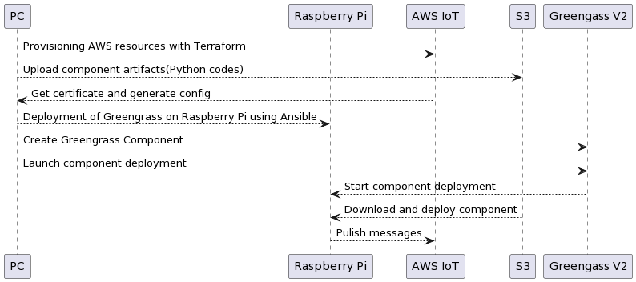

# Greengrass V2 to Raspberry Pi 

Definitions for deploying Greengrass v2 to Raspberry Pi using Terraform and Ansible.




## Prerequisites


#### PC Environment
    - Git
    - Make
    - Docker
    - AWS CLI

#### Raspberry Pi

Using the following OS image. (Should work on other Debian as well)
Make sure to log in via SSH.

https://downloads.raspberrypi.org/raspios_lite_armhf/images/raspios_lite_armhf-2022-09-26/

#### S3 Bucket
Storing Terraform tfstate and the Artifact (Python code) to be deployed to Greengrass.

## How to use

### Adjust Makefile

Adjust the parameters with reference to the following table.

```sh
vim Makefile
```

|Parameter|	Description	|Default Value|
|:--|:--|:--|
|DEVICE_NAME|Used as the Greengrass group and device name|my-ggv2-device|
|AWS_PROFILE|AWS profile|default|
|AWS_REGION|AWS region|ap-northeast-1|
|GREENGRASS_VERSION|Greengrass version|2.9.3|
|COMPONENT_NAME| Greengrass Component name|com.example.greengrassv2|
|COMPONENT_NAME| Greengrass Component version|1.0.0|
|TARGET_IOT_TOPIC|AWS IoT Topic name to Publish the dummy message|$(COMPONENT_NAME)/topic|
|S3_BUCKET| Used for storing tfstate and Greengrass artifacts|-|
|DEVICE_IP| Raspberry Pi IP address|-|


`S3_BUCKET` and `DEVICE_IP` must be specified as arguments to the make command.


### Deploy Commands

```sh
S3_BUCKET=existing-my-bucket
AWS_PROFILE=myprofile
DEVICE_IP=192.168.xxx.xxx

# Deploy AWS resources with Terraform
$ make tf-apply S3_BUCKET=${S3_BUCKET} AWS_PROFILE=${AWS_PROFILE}

# Run Ansible and deploy Greengrass to the device
$ make ansible-apply DEVICE_IP=${DEVICE_IP}

# Create Greengrass components
$ make greengrass-component AWS_PROFILE=${AWS_PROFILE}

# Deploy Greengrass components to the device
$ make greengrass-deploy AWS_PROFILE=${AWS_PROFILE}
```
